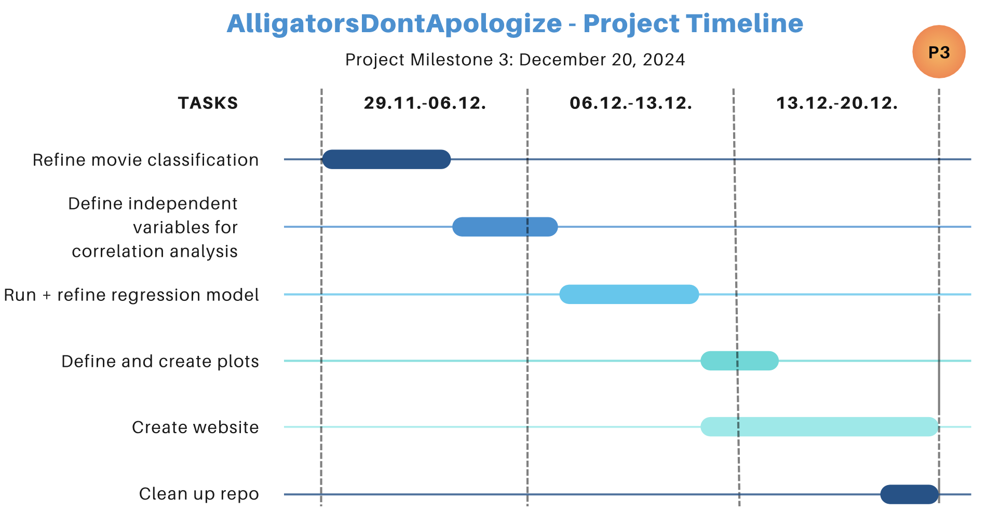

 # P2: AlligatorsDontApologize24 

 ## Project title: 
 ### The feedback loop of violence: How violent movies shape real-world violence
 

 ## Abstract:
 Cruel fist fights, brutal killings, rough sexual assaults - movies sometimes show more explicit violence than we would like. But do they lead to an increase in real-world violence? Or, on the contrary, do they serve as a release that reduces it? This study analyzes 17077 movies from the CMU Dataset [^1], enriched with data from the Kaggle Movies Dataset [^2]. Using this data in combination with the NIBRS dataset [^3], we examine the correlation between depicted violence in movies and real-world violence in the US. To purge the analysis from potential other factors that influence the real world violence, we will use an auto-regressive distributed lag model with time fixed effects. This will allow us to draw valid conclusions from the correlation analysis in order to answer our research questions.

## Main part
Even if very few wou ld have believed it 20 years ago, wars and violent political conflicts are once again present. Moreover, everyday violence seems to be on the rise worldwide, as a study on the perception of violence in one's own neighborhood states [^4]. This underlines the importance of violence as the overall subject of this study. Within our analyses we aim to provide answers on the following research questions: 

* Is there a significant (positive or negative) correlation between the prevalence of violent movies and reported violent crimes in the US?
* Can we identify periods of abnormally many releases of violent movies? 
* Can we identify genres that are particularly violent?

The focus on the geographical area of the US is due to the fact that there is most data available, both for the movies and the real-world violence.
The central dataset for our study is the CMU Dataset [^1]. To enrich this dataset with missing dates and the audience's perception of the movies (rankings), we use The Movies Dataset from Kaggle [^2]. The NIBRS dataset [^3] is used as the source for real-world violent crimes in the US. This dataset aggregates the NIBRS data for all available states in the US from 1991 to 2018.  
The first step in this analysis is to clean and filter the movie data in the CMU dataset. For this, we perform the following processing steps:
* Removing unnecessary columns and NaN entries
* Keep only the entries for which we have both metadata and a plot summary
* Lowercase all plot summaries
* Convert all entries in easily readable format (e.g. convert {"/m/09c7w0": "United States of America"} to "United States of America")
* Filter only for US movies

Moreover, we treat the Kaggle dataset in the same way. This allows us to replace incomplete or missing dates for movies in the CMU dataset with the corresponding data from the Kaggle dataset (matched by the movie title). If neither the CMU nor the Kaggle dataset provide valid information on the movie date, we drop the corresponding entry. The cleaned dataset is exported and saved in .tsv format.

The next step is to identify the violent movies in the cleaned dataset. For this, we defined three scores: 
* Physical violence score
* Psychological violence score
* Sentiment scores

In all three cases, the data source is the plot summary. For the physical and psychological violence score, we identified two separate lists of words that are unambigously connected to physical and psychological violence respectively. For potential further interest in the justification for each word in those lists, we created two .txt files in the data > CLEAN > violent_word_list folder.   
We parse through all plot summaries in the cleaned data and count how often those words appear. This leads to the absolute counts of physical and psychological words in the plot summaries. Since the length of the plot summaries varies significantly, we additionally compute the "density" of physical and psychological words by dividing the absolute counts by the number of words in the plot summary. 
For the sentiment scores, we apply the DistilBERT model trained for sentiment analysis [^5]. This model also parses through all plot summaries and computes scores for the following five sentiments: sadness, joy, love, anger, fear, surprise. The higher the score, the more prevalent is the sentiment. 
With these scores we are able to classify all movies in the cleaned dataset into three categories: 

* Violent 
* Mildly violent
* Non-violent

The classification is done in two ways: first, we train a multiclass logistic regression model on a train set that we labelled by hand using the crowdsourcing approach, i.e. by activating our own social network. Secondly, we use the pre-trained model of mini-GPT (??) and let it label the movies. The labelled dataset is then the final version of the movie data to be used for the correlation analysis in this study. 

* TO BE DONE: How do we process the violence dataset ?

With the processed datasets at hand we can now perform the correlation analysis. Simply running a linear regression model of the number of violent movies on the number of reported violent crimes is not sufficiend: there are various other factors that influence the real-world violence that we would not account for in this model. Thus, we would not be able to draw valid conclusions from the regression coefficients. Instead, we will implement an auto-regressive distributed lag model with time fixed effects. Also, we want to make the temporal resolution as fine as possible. With this, we can tackle the various other unknown influences in the following way: 
* The daily (or monthly) temporal resolution allows to observe immediate effects of significantly many releases of violent movies.
* Time-fixed effects allow to "absorb" higher-level influencing factors (like wars, riots, etc.).
* The autoregressive lag allows to account for the effect that times of higher level of violence usually do not end immediately.

The proposed further timeline for our project is the following: 

The list of tasks until P3 mentioned in the picture below are equally shared within the team to ensure that every team member contributes to the project.

[^1]: http://www.cs.cmu.edu/~ark/personas/
[^2]: https://www.kaggle.com/datasets/rounakbanik/the-movies-dataset
[^3]: https://www.dolthub.com/repositories/Liquidata/fbi-nibrs/data/main
[^4]: Jackson, Chris. *Views on Crime and Law Enforcement Around the World*, Ipsos, 2023.
[^5]: https://huggingface.co/bhadresh-savani/distilbert-base-uncased-emotion